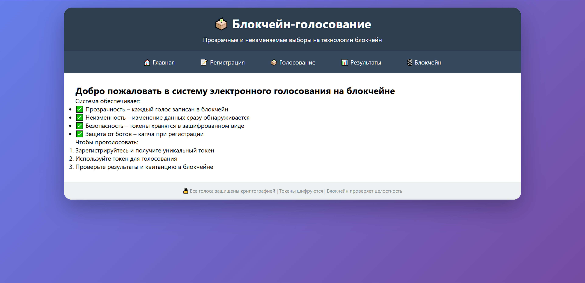
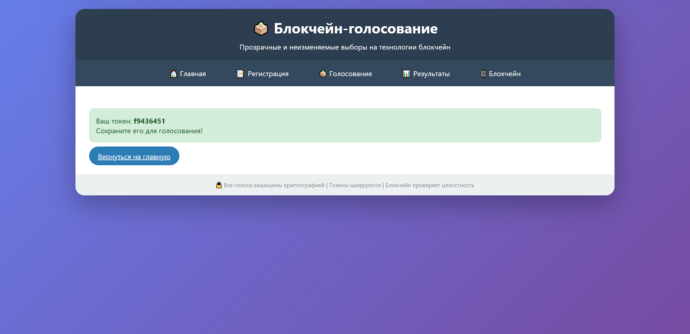
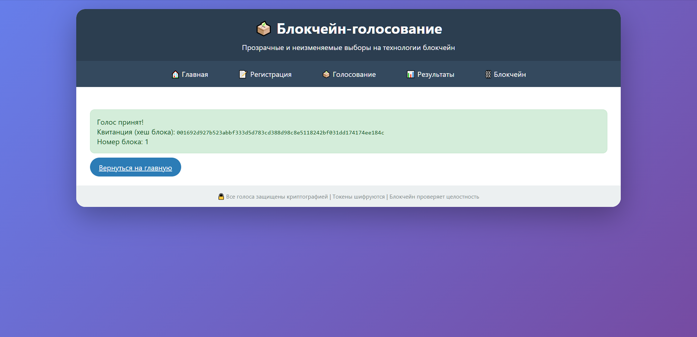
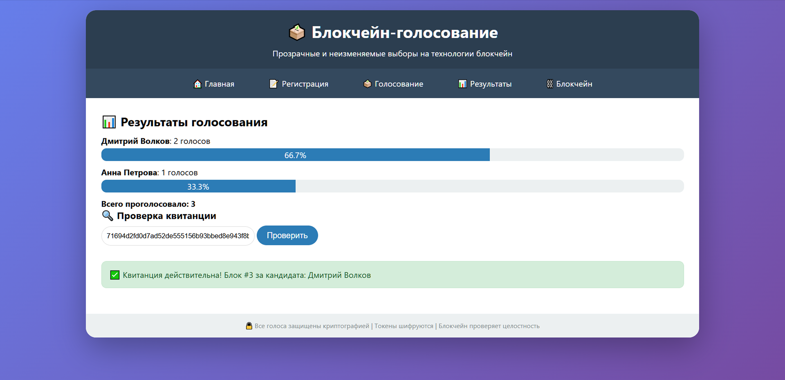
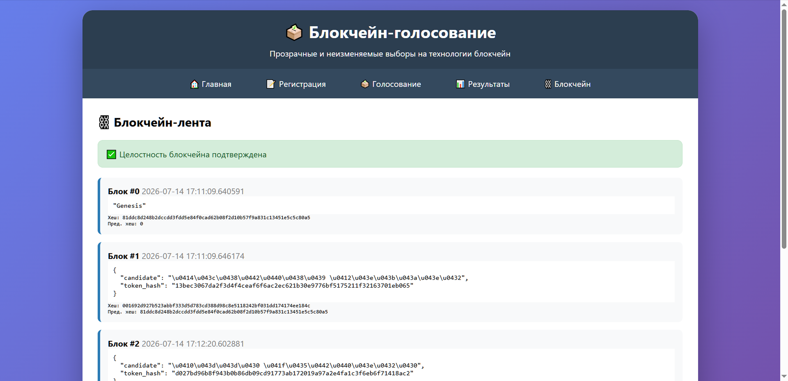

# 🗳️ Blockchain Voting System

## Diploma Project

Electronic voting system developed as a diploma project for the specialty **Information Security of Automated Systems**.

### Description

The project is a prototype of an electronic voting system based on blockchain technology. The goal is to ensure the transparency and integrity of voting results.

### Technologies

- Python
- Flask
- HTML
- CSS
- SQLite
- SHA-256

### Features

- User registration
- Electronic voting
- Blockchain-based vote storage
- Vote integrity verification

### Project structure

- `app.py` — application logic
- `templates/` — HTML templates

### Author

Anastasia Vasilieva

## Screenshots

### Main page

### Token generation

### Vote confirmation

### Results verification

### Blockchain integrity verification

## System architecture

The system consists of several main components:

- **Frontend** — HTML/CSS templates for user interaction.
- **Backend** — Flask application responsible for processing requests and voting logic.
- **Database** — SQLite database for storing user information and tokens.
- **Blockchain ledger** — storage of voting records with integrity verification.
- **Cryptographic mechanisms** — SHA-256 hashing and encryption for data protection.
